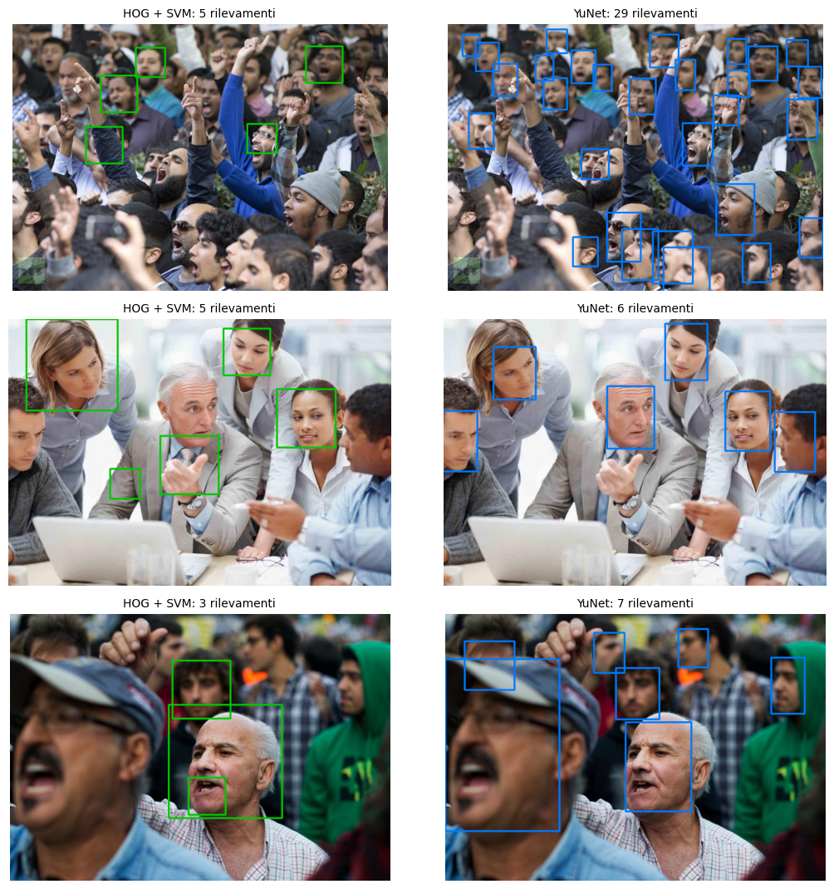
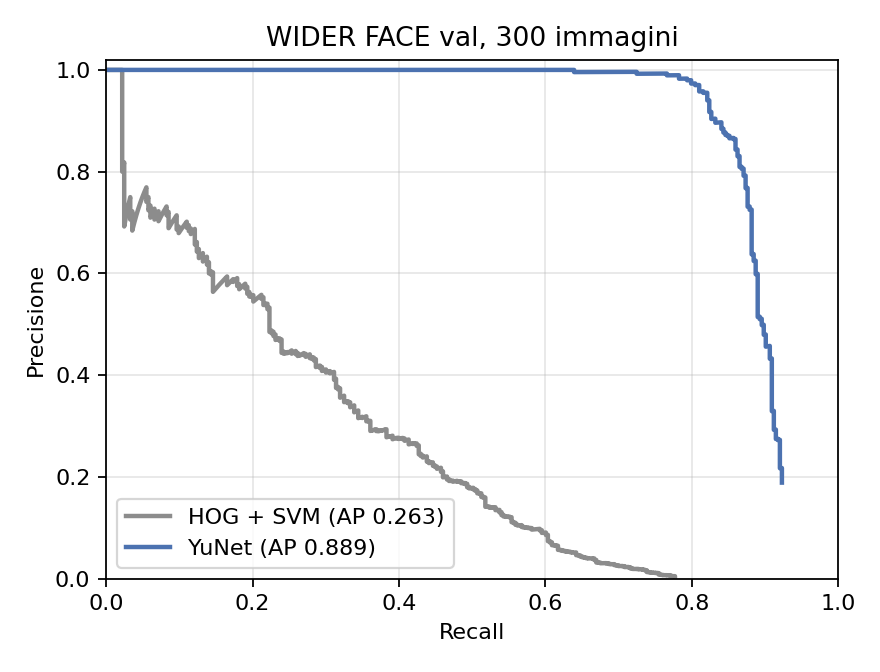

# Face detection · HOG + SVM a confronto con YuNet

Rilevamento di volti in foto reali, misurato sul benchmark **WIDER FACE**.
Il progetto nasce come esercitazione del Master in AI Engineering (caso *ProCam*: fotocamera con hardware limitato,
vincolo di usare un rilevatore **classico**, senza reti neurali). L'ho rifatto in due fasi:
prima ho corretto e misurato onestamente il rilevatore HOG + SVM, poi l'ho confrontato con **YuNet**, una piccola rete convoluzionale.

**▶ Demo live:** [Hugging Face Spaces](https://huggingface.co/spaces/MassimilianoCantore/face-detection) — carichi una foto e vedi i due rilevatori fianco a fianco.



## Risultati (WIDER FACE val, 300 immagini, 363 volti, stesso protocollo)

| Rilevatore | AP@0.5 | Precisione | Recall | Tempo per immagine (CPU) | Dimensione modello |
|---|---|---|---|---|---|
| HOG + SVM (addestrato da me) | 0.263 | 0.26 | 0.43 | 3.134 ms | 9,9 MB |
| **YuNet** (OpenCV Zoo) | **0.889** | **0.62** | **0.89** | **54 ms** | **233 KB** |



Sull'hardware limitato una piccola CNN **costa meno** del rilevatore classico, non di più: AP più che triplicata,
~58 volte più veloce, file ~40 volte più piccolo. La finestra scorrevole di HOG valuta decine di migliaia di finestre per immagine,
YuNet produce tutti i riquadri in un solo passaggio.

## Il percorso

### 1 · HOG + SVM, corretto e misurato ([notebook](notebooks/01_hog_svm_wider_face.ipynb))
Descrittore HOG → SVM con kernel RBF → finestra scorrevole su piramide di scale → hard negative mining → NMS.
Nella revisione ho corretto i problemi della prima versione:

- **nessuna metrica**: il test set veniva creato ma mai valutato → AP, precisione e recall su WIDER FACE;
- **leakage**: i volti venivano duplicati (ruotati) *prima* dello split → split per **immagine** (GroupKFold);
- **feature diverse tra training e detection**: HOG su patch isolate contro HOG sull'immagine intera → patch con contesto;
- **lentezza**: SVM RBF esatta ~53 s per immagine → kernel approssimato (Nyström) + SVM lineare, ~3 s;
- NMS con soglia 0.05 (cancellava volti vicini), volti "veri" ritagliati con un altro rilevatore (dlib), foto di test protetta da copyright.

Il classificatore di finestre è buono (AP 0.971 sulle patch), ma sull'immagine intera scende a **AP 0.263**:
con decine di migliaia di finestre per foto anche pochi errori diventano molti falsi positivi,
e i volti piccoli, di profilo o coperti restano fuori dalla portata di HOG.

### 2 · Confronto con YuNet ([notebook](notebooks/02_confronto_yunet.ipynb))
Stesse 300 immagini, stessa risoluzione di lavoro (640 px), stesso protocollo di valutazione (IoU ≥ 0.5,
volti sotto la finestra minima di HOG ignorati per entrambi).
La precisione di YuNet è probabilmente sottostimata: molti suoi "falsi positivi" sono volti reali non annotati in WIDER FACE.

## Struttura

```
notebooks/   01 HOG + SVM su WIDER FACE · 02 confronto con YuNet (eseguiti, con output)
src/         HogSvmDetector e YuNetDetector con la stessa interfaccia
app/         demo Gradio (Hugging Face Spaces)
results/     tabella del confronto e grafici
```

## Uso

```bash
pip install -r requirements.txt
```
```python
import cv2
from huggingface_hub import snapshot_download
from face_detection.detectors import HogSvmDetector, YuNetDetector

img = cv2.imread("foto.jpg")
YuNetDetector().detect(img)                                   # [(x1, y1, x2, y2, score), ...]
HogSvmDetector(snapshot_download("MassimilianoCantore/face-detection-hog-svm")).detect(img)
```

I notebook sono pensati per Google Colab; WIDER FACE viene scaricato automaticamente da Hugging Face (`CUHK-CSE/wider_face`).

## Riferimenti
- Dalal & Triggs, *Histograms of Oriented Gradients for Human Detection*, CVPR 2005
- Yang et al., *WIDER FACE: A Face Detection Benchmark*, CVPR 2016
- Wu et al., *YuNet: A Tiny Millisecond-level Face Detector*, Machine Intelligence Research 2023 · [OpenCV Zoo](https://github.com/opencv/opencv_zoo)

## Stack
Python · OpenCV · scikit-image · scikit-learn · NumPy · Gradio · Hugging Face Hub

---
Massimiliano Cantore · [LinkedIn](https://www.linkedin.com/in/massimiliano-cantore-3b19704a/)
